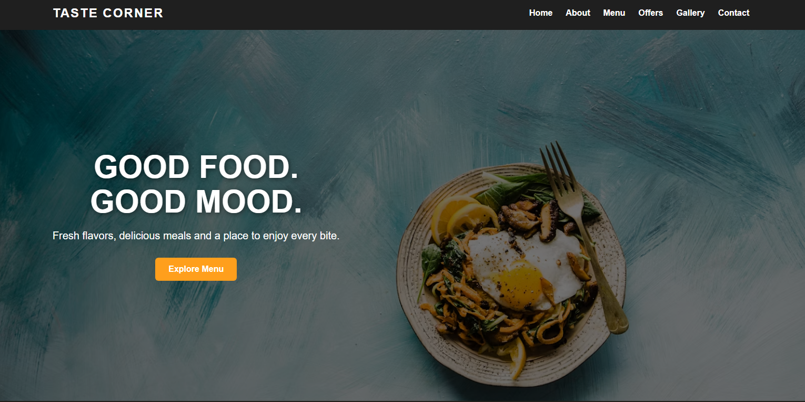
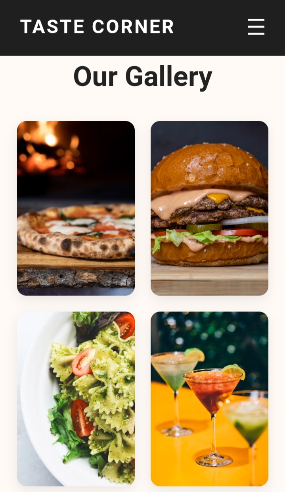

# 🍽️ Taste Corner

A modern, responsive restaurant website built using HTML, CSS and JavaScript.

## 🌐 Live Website

[Visit Taste Corner](https://arppra2007-lgtm.github.io/taste-corner/)

## 🖥️ Desktop Screenshot



## 📱 Mobile Screenshot



## ✨ Features

* Responsive design
* Mobile-friendly navigation
* Hero section
* Restaurant menu
* Special offers section
* Food gallery
* Contact section
* WhatsApp booking button
* Smooth hover effects
* Mobile menu

## 🛠️ Technologies Used

* HTML5
* CSS3
* JavaScript

## 📱 Responsive Design

The website is designed to work smoothly on:

* 💻 Desktop
* 📱 Mobile
* 📲 Tablet

## 📂 Project Structure

```text
taste-corner/
├── index.html
├── style.css
├── script.js
├── README.md
└── screenshot/
    ├── desktop.png
    └── mobile.jpeg
```

## 🎯 Project Goal

This project was created as part of my web development learning journey and portfolio building.

## 🚀 Future Improvements

* Online food ordering
* Real-time table booking
* Customer reviews
* Admin dashboard
* Online payment integration

---

Made with ❤️ using HTML, CSS and JavaScript.
